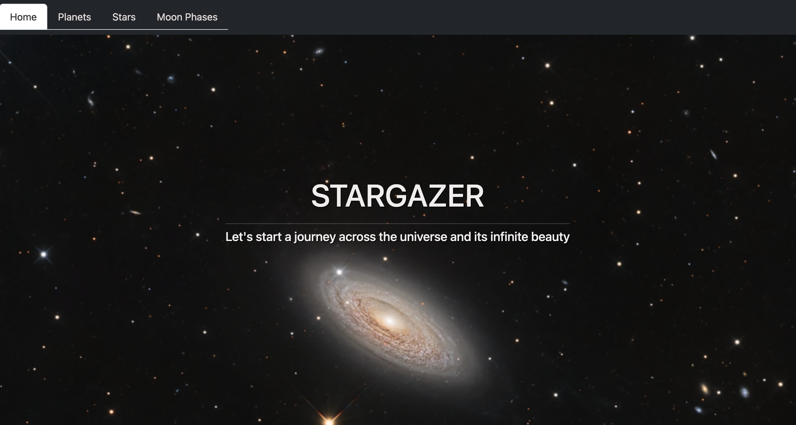

# Stargazer

*** 

## Description
Stargazer is an application that will help you to explore more about our Universe in very simple and enjoing way. Use Stargazer to learn all about the planets in the solar system, read about the constellations populating the sky or get to know more about moon phases.

***

## Table of Contents
* [Built with](#built-with)
* [App in action](#app-in-action-images)
* [Installation](#Installation)
* [Usage](#Usage)
* [Contributing](#Contributing)
* [Acknowledgements](#acknowledgements)
* [Questions](#Questions)

## Built with
Stargazer was built with a combination of:
* HTML
* CSS
* Javascript/JSX
* React
* BootStrap
* Netlify
* APIs: 
  * World Weather Online(Astronomy API)
  * NASA Picture of the Day API
  * Stars API 
  * Planets API
* npm: sunlac, axios

***

## App in action (images)

### Home Page

Home Page background is the NASA Picture of the day, which will be changed every day, based on the new picture of the day.

### Planets Page

### Moon Page 

***

## Installation
As this is all able to run inside the browser you won't need to install anything to run this app.
To deploy, simply follow the URL and begin searching. 

### Deploy using this link: https://beyond-earth-space-explorer.netlify.app/

***

## Usage
If you want to have this project on your computer, please clone the repo and run the following command: `npm install` and `npm start`.

*** 

## Contributing 
Fork and pull request

***

## Acknowledgements
* Angelo Ilardi
* Ivanna Kuliak

***

## Questions
If you have any questions about the repo, open an issue or contact developers of this project directly at ivanna.kuliak@gmail.com or ange448@gmail.com.
You can find more of our works at: 
[github.com/Ivanna0803](https://github.com/Ivanna0803)
[github.com/helldorado82](https://github.com/helldorado82)
